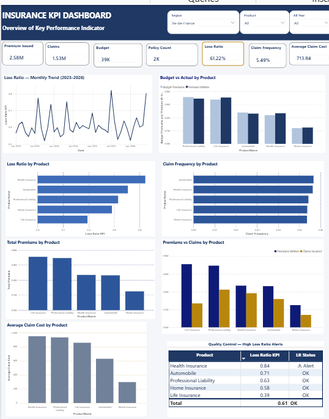

# 📊 Power BI Insurance KPI Dashboard

End-to-end Power BI dashboard for insurance QBR/MBR KPI analysis.
Built from scratch in Power BI Desktop — star schema data model,
custom DAX measures, interactive filtering by region and product.

## 🔑 Key Results
- Overall Loss Ratio: **60.09%**
- Health Insurance Loss Ratio: **82%** (⚠️ Alert — above 75% threshold)
- Total Premiums Written: **€15.68M**
- Total Claims Incurred: **€9.06M**
- Average Claim Cost: **€684.67**
- Claim Frequency: **5.55%**

## 🛠️ Tech Stack
Power BI · DAX · Power Query · Star Schema · SQL · GitHub

## 📁 Files in this Repository
| File | Description |
|------|-------------|
| `insurance kpi.pbix` | Power BI dashboard file |
| `Data_Insurance.zip` | Source data (CSV files) |
| `PowerBI_Dashboard_Report_EN.docx` | Full project report |

## 📐 Data Model
- **3 Fact Tables:** Fact_Premiums, Fact_Claims, Fact_Budget
- **4 Dimension Tables:** Dim_Date, Dim_Product, Dim_Territory, Dim_Policy

## 🧮 DAX Measures Built

Loss Ratio KPI = DIVIDE(SUM(Fact_Claims[TotalClaims]), SUM(Fact_Premiums[PremiumEarned]))
Claim Frequency = DIVIDE(SUM(Fact_Claims[ClaimCount]), SUM(Fact_Premiums[PolicyCount]))
Average Claim Cost = DIVIDE(SUM(Fact_Claims[TotalClaims]), SUM(Fact_Claims[ClaimCount]))
LR Status = IF([Loss Ratio KPI] > 0.75, "⚠ Alert", "OK")

## 👩‍💻 Author
**Anitha Kumar** | MSc Data Science (DSA) | EPITA, Paris | 
